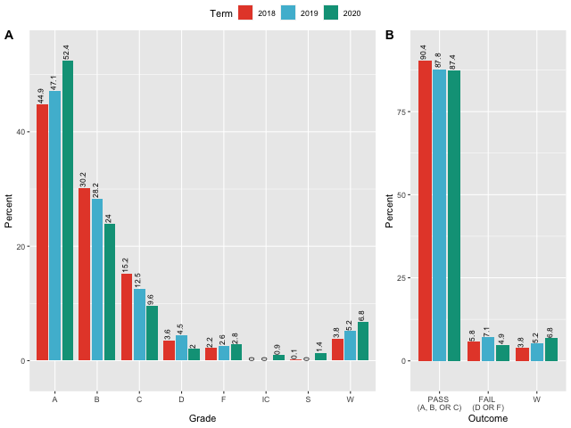
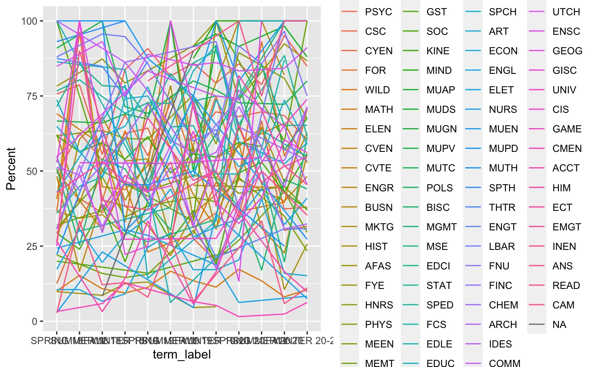

```{r setup, include=FALSE}
knitr::opts_chunk$set(echo = FALSE)
library(tidyverse)
library(readxl)
library(plotly)
library(tidymodels)
library(poissonreg)
library(ggeffects)
library(jtools)
library(kableExtra)
library(gridExtra)
library(cowplot)
library(lmtest)
library(sandwich)
library(ggpubr)

`%notin%` <- Negate(`%in%`)


set.seed(4798)
data <- read_excel("Grades by Instructor and Course - Spring 2018 thru Winter 2021.xls")%>%
    rename(grade = `Grade Awarded`) %>%
    filter(grade != 'AU') %>%
    mutate(termC = as.character(Term)) %>%
    mutate(Instructor = forcats::as_factor(Instructor), 
           Course = forcats::as_factor(Course),
           Term = forcats::as_factor(termC),
           Grade = factor(grade, levels = c("A", "B", "C", "D", "F", "W", "S", "IC"))) %>%
    mutate(Dept = forcats::as_factor(str_extract(Course, '[:alpha:]{3,4}')),
           Course_Number = forcats::as_factor(str_extract(Course, '[:digit:]{3}')),
           Section = forcats::as_factor((str_extract(Course,'[:alnum:]{3}$')))) %>%
  mutate(Honors = forcats::as_factor(ifelse(str_detect(as.character(Section),"^H")==TRUE,1,0)),
         Online = forcats::as_factor(ifelse(str_detect(as.character(Section),"^V")==TRUE,1,0))) %>%
    mutate(Upper = forcats::as_factor(ifelse(as.numeric(as.character(Course_Number)) >= 300,1,0))) %>%
  mutate(Grad = forcats::as_factor(ifelse(as.numeric(as.character(Course_Number)) >= 500,1,0))) %>%
    unite("ID", Dept:Course_Number, sep = "", remove = FALSE) %>%
    mutate(ID = forcats::as_factor(ID)) %>%
  unite(FULL_ID, Dept:Course_Number:Section, sep = "-", remove = FALSE)%>%
    dplyr::select(-c(termC,grade,Course))


data$Instructor <- data$Instructor %>% fct_anon()

data$pfw <- fct_recode(data$Grade, "PASS" = "A", "PASS" = "B", "PASS" = "C", "PASS" = "S", "FAIL" = "D", "FAIL" = "F")
data$term_label <- fct_recode(data$Term, "SPRING 18" = "20183", "SUMMER 18" = "20184", "FALL 18" = "20191", "WINTER 18-19" = "20192", "SPRING 19" = "20193", "SUMMER 19" = "20194", "FALL 19" = "20201", "WINTER 19-20" = "20202", "SPRING 20" = "20203", "SUMMER 20" = "20204", "FALL 20" = "20211", "WINTER 20-21" = "20212")

data$term_label <- fct_relevel(data$term_label,"SPRING 18", "SUMMER 18", "FALL 18", "WINTER 18-19", "SPRING 19", "SUMMER 19", "FALL 19", "WINTER 19-20", "SPRING 20", "SUMMER 20", "FALL 20", "WINTER 20-21")

data$quarter <- fct_recode(data$term_label, "SPRING" = "SPRING 18","SUMMER" = "SUMMER 18","FALL" = "FALL 18","WINTER" = "WINTER 18-19","SPRING" = "SPRING 19","SUMMER" = "SUMMER 19","FALL" = "FALL 19", "WINTER" = "WINTER 19-20","SPRING" = "SPRING 20","SUMMER" = "SUMMER 20","FALL" = "FALL 20","WINTER" = "WINTER 20-21")

data$quarter <- fct_relevel(data$quarter, "FALL", "WINTER", "SPRING", "SUMMER")


#filter(str_detect(termC, "3$")) %>%
```

## Introduction

- Global pandemic
- Transition to online instruction
- How can we characterize this transition?


## A Quasi-Experiment

> - Louisiana Tech is on a quarter schedule with semester hours.
> - SP20 had only begun when we transitioned online.

## A Quasi-Experiment | A Hypothesis

<figure>
<blockquote cite="http://www.worldwildlife.org/who/index.html"> 
<p>We expected that the grade distribution would be increasingly bi-modal, with students either excelling or failing under the circumstances. We presumed this outcome because many of the “A” students will be “A” students no matter the circumstances. Some students have the intellect, but lack the discipline to complete a course online. We expected those students to complete in-person coursework with “Bs” and “Cs,” and we were not certain that those students would complete the online quarter.</p>
</blockquote>

<font size="2">Holderieath, J.J., M.K. Crosby, T.E. McConnell, and D.P. Jackson. 2021. “Impact of COVID-19-Related Transition to Online Instruction on Student Achievement.” Applied Economics Teaching Resources (AETR) 3(1).</font></figcaption>
</figure>


## Initial Graphical Analysis 



<font size="2">Holderieath, J.J., M.K. Crosby, T.E. McConnell, and D.P. Jackson. 2021. “Impact of COVID-19-Related Transition to Online Instruction on Student Achievement.” Applied Economics Teaching Resources (AETR) 3(1).</font>

## Poisson Regression

> - Compared the two previous spring terms to SP 21, using SASF data.
> - Compared Proportion earning As, Proportion Finishing, and Proportion Passing
> - No significant relationship between the SP21 dummy and the dependent variables. 
> - More detailed graphical analysis showed that there was not a single common experience. 
> - Some classes did not see that much change.
> - Some classes, especially difficult classes, had much higher drop rates. A few classes had _fewer_ students drop!
> - Some classes had much higher rates of students earning A's and some classes had much lower rates.

<font size="2">Holderieath, J.J., M.K. Crosby, T.E. McConnell, and D.P. Jackson. 2021. “Impact of COVID-19-Related Transition to Online Instruction on Student Achievement.” Applied Economics Teaching Resources (AETR) 3(1).</font>

## Marginal Effects Via Prediction

```{r echo=FALSE, message=FALSE, warning=FALSE}
olddat <- read_excel("sasf_sp21.xls") %>%
    rename(grade = `Grade Awarded`) %>%
    filter(grade != 'AU') %>%
    mutate(termC = as.character(Term)) %>%
    filter(str_detect(termC, "3$")) %>%
    mutate(Instructor = forcats::as_factor(Instructor), 
           Course = forcats::as_factor(Course),
           Term = forcats::as_factor(termC),
           Grade = factor(grade, levels = c("A", "B", "C", "D", "F", "W", "S", "IC"))) %>%
    mutate(Dept = forcats::as_factor(str_extract(Course, '[:alpha:]{3,4}')),
           Course_Number = forcats::as_factor(str_extract(Course, '[:digit:]{3}'))) %>%
    mutate(Upper = forcats::as_factor(ifelse(as.numeric(as.character(Course_Number)) >= 300,1,0))) %>%
    unite("ID", Dept:Course_Number, sep = "", remove = TRUE) %>%
    mutate(ID = forcats::as_factor(ID)) %>%
    dplyr::select(-c(termC,grade,Course))

olddat$Instructor <- olddat$Instructor %>% fct_anon()

olddat$pfw <- fct_recode(olddat$Grade, "PASS" = "A", "PASS" = "B", "PASS" = "C", "PASS" = "S", "FAIL" = "D", "FAIL" = "F")

olddat2 <- olddat %>%
    filter(ID != 'OTHER')%>%
    fastDummies::dummy_cols() %>%
    group_by(ID,Instructor,Term)%>%
    summarise(PASSING = sum(Grade_A,Grade_B,Grade_C,Grade_S),
              FAILING = sum(Grade_D,Grade_F),
              FINISHING = sum(pfw_PASS,pfw_FAIL),
              NOTFINISHING = sum(pfw_W,pfw_IC),
              n = n(),
              EarnA = sum(Grade_A))
olddat3 <- olddat2 %>%
  mutate(PCT_PASS = round(PASSING/(PASSING+FAILING)*100),
              PCT_FINISH = round(FINISHING/(FINISHING+NOTFINISHING)*100),
              PCT_A = round(EarnA/(PASSING+FAILING)*100)
              )

olddat3u <- ifelse(as.numeric(stringr::str_extract(olddat3$ID,'[:digit:]{3}$'))>299,1,0)
olddat3u <- replace_na(olddat3u,1)
olddat3_dum <- olddat3 %>%
  add_column(UPPER = olddat3u)%>%
    fastDummies::dummy_cols() %>%
    mutate(
Term_20183     = forcats::as_factor(Term_20183),
Term_20193     = forcats::as_factor(Term_20193),
Term_20203     = forcats::as_factor(Term_20203),
UPPER     = forcats::as_factor(UPPER),
Instructor_11  = forcats::as_factor(Instructor_11),  
Instructor_12  = forcats::as_factor(Instructor_12),  
ID_AGBU310  = forcats::as_factor(ID_AGBU310),  
ID_AGBU402  = forcats::as_factor(ID_AGBU402),  
ID_AGSC211  = forcats::as_factor(ID_AGSC211),   
ID_AGSC320  = forcats::as_factor(ID_AGSC320), 
ID_AGSC411  = forcats::as_factor(ID_AGSC411),  
ID_ANSC223  = forcats::as_factor(ID_ANSC223),   
ID_ANSC224  = forcats::as_factor(ID_ANSC224), 
ID_ANSC230  = forcats::as_factor(ID_ANSC230),  
ID_ANSC301  = forcats::as_factor(ID_ANSC301),  
ID_ANSC315  = forcats::as_factor(ID_ANSC315),   
ID_ANSC340  = forcats::as_factor(ID_ANSC340), 
ID_ANSC409  = forcats::as_factor(ID_ANSC409),  
ID_ANSC411  = forcats::as_factor(ID_ANSC411),  
ID_FOR111   = forcats::as_factor(ID_FOR111),
ID_FOR200   = forcats::as_factor(ID_FOR200),
ID_FOR230   = forcats::as_factor(ID_FOR230), 
ID_FOR233   = forcats::as_factor(ID_FOR233), 
ID_FOR302   = forcats::as_factor(ID_FOR302), 
ID_FOR313   = forcats::as_factor(ID_FOR313),
ID_FOR402   = forcats::as_factor(ID_FOR402),
ID_FOR404   = forcats::as_factor(ID_FOR404), 
ID_FOR480   = forcats::as_factor(ID_FOR480),
ID_GISC250  = forcats::as_factor(ID_GISC250), 
ID_GISC260  = forcats::as_factor(ID_GISC260),  
ID_PLSC101  = forcats::as_factor(ID_PLSC101),  
ID_PLSC211  = forcats::as_factor(ID_PLSC211),  
ID_PLSC284  = forcats::as_factor(ID_PLSC284),   
ID_PLSC310  = forcats::as_factor(ID_PLSC310), 
ID_PLSC311  = forcats::as_factor(ID_PLSC311),  
ID_PLSC312  = forcats::as_factor(ID_PLSC312),  
ID_PLSC400  = forcats::as_factor(ID_PLSC400),  
ID_WILD314  = forcats::as_factor(ID_WILD314),   
ID_WILD347  = forcats::as_factor(ID_WILD347)
    ) 

finish_formula <-  PCT_FINISH  ~ Term_20203 + Term_20193 + UPPER + 
  ID_AGBU310  + 
  ID_AGSC211 + ID_AGSC320 + ID_AGSC411 + 
  ID_ANSC230 + ID_ANSC223 + ID_ANSC224 + ID_ANSC301 + ID_ANSC315  + ID_ANSC409 + ID_ANSC411 + 
  ID_FOR111  + ID_FOR230 + ID_FOR233 + ID_FOR302 + ID_FOR313 + ID_FOR402 + ID_FOR404 + ID_FOR480 + 
   
  ID_PLSC101  + ID_PLSC310 + ID_PLSC311 + ID_PLSC312 + ID_PLSC400 + 
  ID_WILD314 +
  Instructor_12 + ID_AGBU402+ ID_FOR200 +ID_GISC250 + ID_GISC260 + ID_ANSC340 + ID_PLSC211

pass_formula <-  PCT_PASS  ~ Term_20203 + Term_20193 + UPPER +
    ID_AGBU310 + ID_AGBU402 + 
  ID_AGSC211 + ID_AGSC320 + ID_AGSC411 + 
  ID_ANSC230 + ID_ANSC223 + ID_ANSC224 + ID_ANSC301 + ID_ANSC315 + ID_ANSC340 + ID_ANSC409 + ID_ANSC411 + 
  ID_FOR111 + ID_FOR200  + ID_FOR233 + ID_FOR302  + ID_FOR402 + ID_FOR404 + ID_FOR480 + 
   ID_GISC260 + 
   ID_PLSC211  + ID_PLSC310 + ID_PLSC311 + ID_PLSC312 + ID_PLSC400 + 
  ID_WILD314 + ID_GISC250 + + ID_FOR313 + ID_FOR230 +ID_PLSC101 +
  Instructor_12

A_formula <-  PCT_A  ~ Term_20203 + Term_20193 + UPPER +
  ID_AGBU310 + ID_AGBU402 + 
  ID_AGSC211 + ID_AGSC320 + ID_AGSC411 + 
  ID_ANSC230 + ID_ANSC223 + ID_ANSC224 + ID_ANSC301 + ID_ANSC315 + ID_ANSC340 + ID_ANSC409 + ID_ANSC411 + 
  ID_FOR111 + ID_FOR200 + ID_FOR230 + ID_FOR233 + ID_FOR302 + ID_FOR313 + ID_FOR402 + ID_FOR404 + ID_FOR480 + 
  ID_GISC250 + ID_GISC260 + 
  ID_PLSC101 + ID_PLSC211  + ID_PLSC310 + ID_PLSC311 + ID_PLSC312 + ID_PLSC400 + 
  ID_WILD314 +
  Instructor_12

finish_poisson <- glm(finish_formula, family = poisson(link = "identity"), data = olddat3_dum)
#summary(finish_poisson)
fp <- coeftest(finish_poisson, vcov = vcovHC(finish_poisson, type="HC1"))
#fp

pass_poisson <- glm(pass_formula, family = poisson(link = "identity"), data = olddat3_dum )
#summary(pass_poisson)
pp <- coeftest(pass_poisson, vcov = vcovHC(pass_poisson, type="HC1"))
#pp

a_poisson <- glm(A_formula, family = quasipoisson, data = olddat3_dum)
#summary(a_poisson)
pa <- coeftest(a_poisson, vcov = vcovHC(a_poisson, type="HC1"))
#pa
ggFinish <- ggpredict(finish_poisson,  "Term_20203")
predict_Finish <- plot(ggFinish, add.data = TRUE) + 
    xlab('Spring 2020 Binary') +
    ylab('Predicted Percent \nFinishing') +
    ggtitle('')+ 
  cowplot::theme_minimal_hgrid(11)
#predict_Finish
#Fig 2 Panel B
ggPass <- ggpredict(pass_poisson, terms = "Term_20203")
predict_Pass <- plot(ggPass, add.data = TRUE) + 
    xlab('Spring 2020 Binary') +
    ylab('Predicted Percent \nPassing') +
    ggtitle('')+ 
  cowplot::theme_minimal_hgrid(11)
#predict_Pass
#Fig 2 Panel C
ggA <- ggpredict(a_poisson, terms = "Term_20203")
predict_A <- plot(ggA,add.data = TRUE) + 
  xlab('Spring 2020 Binary') +
    ylab('Predicted Percent \nEarning A') +
    ggtitle('')+ 
  cowplot::theme_minimal_hgrid(11)
#predict_A

#Fig 2 Combined
predict <- cowplot::plot_grid(predict_Finish,predict_Pass,predict_A,
                    labels = c("A. Predicted Percent Finishing",
                               "B. Predicted Percent Passing",
                               "C. Predicted Percent Earning an A"), 
                    label_size = 10, hjust = 0, ncol = 3)
predict
#ggplotly(predict)
```

<font size="2">Holderieath, J.J., M.K. Crosby, T.E. McConnell, and D.P. Jackson. 2021. “Impact of COVID-19-Related Transition to Online Instruction on Student Achievement.” Applied Economics Teaching Resources (AETR) 3(1).</font>


## Historical Comparisons

```{r}
hist_FINISH_v <- ggplot(olddat3_dum, aes(x=Term, y=PCT_FINISH)) + 
  geom_violin()+
  geom_boxplot(width=0.1)+
      xlab('Term') +
    ylab('Historic Percent \nFinishing') +
  scale_y_continuous(expand = c(0.1, .1))+
  scale_x_discrete(labels=c("20183" = "SP18", "20193" = "SP19", "20203" = "SP20"))+ 
  cowplot::theme_minimal_hgrid(11)
sp1 <- plotly::ggplotly(hist_FINISH_v)
#Fig 3 Panel B
hist_PASS_v <- ggplot(olddat3_dum, aes(x=Term, y=PCT_PASS)) + 
  geom_violin()+
  geom_boxplot(width=0.1)+
      xlab('Term') +
    ylab('Historic Percent \nPassing') +
  scale_x_discrete(labels=c("20183" = "SP18", "20193" = "SP19","20203" = "SP20"))+ 
  scale_y_continuous(expand = c(0.1, .1))+
  cowplot::theme_minimal_hgrid(11)
sp2 <- plotly::ggplotly(hist_PASS_v)
#Fig 3 Panel C
hist_A_v <- ggplot(olddat3_dum, aes(x=Term, y=PCT_A)) + 
  geom_violin()+
  geom_boxplot(width=0.1)+
      xlab('Term') +
    ylab('Historic Percent \nEarning A') +
  scale_x_discrete(labels=c("20183" = "SP18", "20193" = "SP19", "20203" = "SP20"))+ 
  scale_y_continuous(expand = c(0.1, .1))+
  cowplot::theme_minimal_hgrid(11)
sp3 <- plotly::ggplotly(hist_A_v)

#subplot(sp1, sp2, sp3)

cowplot::plot_grid(hist_FINISH_v,hist_PASS_v,hist_A_v,
                    labels = c("A. Historic Distribution \nof Percent Finishing",
                               "B. Historic Distribution \nof Percent Passing",
                               "C. Historic Distribution \nof Percent Earning an A"), 
                    label_size = 10, hjust = -0.25,  ncol = 3, vjust = 1)
```

<font size="2">Holderieath, J.J., M.K. Crosby, T.E. McConnell, and D.P. Jackson. 2021. “Impact of COVID-19-Related Transition to Online Instruction on Student Achievement.” Applied Economics Teaching Resources (AETR) 3(1).</font>


## History By Class | Finishing

```{r echo=FALSE, message=FALSE, warning=FALSE}
hist_FINISH <-  olddat3_dum %>%
  filter(ID %notin% c('ANSC223','ANSC230','ANSC301','ANSC315','PLSC312','WILD314')) %>%
  ggplot(aes(x = Term, y = PCT_FINISH,   group =   interaction(UPPER,ID)))+
  geom_point() + 
  geom_smooth(method = 'lm',se=FALSE, size=1)+
  stat_regline_equation(label.y=25, size = 2.5)+
  facet_wrap('ID',nrow = 4)+
    xlab('Term') +
    ylab('Historic Percent \nFinishing') +
    ggtitle('Slope of Historic Percent Finishing')+
  theme(legend.position="none")+
  scale_x_discrete(labels=c("20183" = "SP18", "20193" = "SP19", "20203" = "SP20"))+
  scale_y_continuous(breaks=c(33,66,100), limits=c(0, NA))+
  cowplot::theme_minimal_hgrid(11)
plotly::ggplotly(hist_FINISH)

```

<font size="2">Holderieath, J.J., M.K. Crosby, T.E. McConnell, and D.P. Jackson. 2021. “Impact of COVID-19-Related Transition to Online Instruction on Student Achievement.” Applied Economics Teaching Resources (AETR) 3(1).</font>


##  History By Class | Passing

```{r echo=FALSE, message=FALSE, warning=FALSE}
hist_PASS <-  olddat3_dum %>%
  filter(ID %notin% c('ANSC223','ANSC230','ANSC301','ANSC315','PLSC312','WILD314')) %>%
  ggplot(aes(x = Term, y = PCT_PASS,   group =   interaction(UPPER,ID)))+
  geom_point() + 
  geom_smooth(method = 'lm',se=FALSE, size=1)+
  stat_regline_equation(label.y=25, size = 2.5)+
  facet_wrap('ID',nrow = 4)+
    xlab('Term') +
    ylab('Historic Percent \nPassing') +
  scale_y_continuous(breaks=c(33,66,100), limits=c(0, NA))+
    ggtitle('Slope of Historic Percent Passing')+ 
  theme(legend.position="none")+
  scale_x_discrete(labels=c("20183" = "SP18", "20193" = "SP19",  "20203" = "SP20"))+ 
  cowplot::theme_minimal_hgrid(11)

plotly::ggplotly(hist_PASS)
```

<font size="2">Holderieath, J.J., M.K. Crosby, T.E. McConnell, and D.P. Jackson. 2021. “Impact of COVID-19-Related Transition to Online Instruction on Student Achievement.” Applied Economics Teaching Resources (AETR) 3(1).</font>


##  History By Class | Earning an A

```{r echo=FALSE, message=FALSE, warning=FALSE}
hist_A_indiv <-  olddat3_dum %>%
  filter(ID %notin% c('ANSC223','ANSC230','ANSC301','ANSC315','PLSC312','WILD314')) %>%
  ggplot(aes(x = Term, y = PCT_A, group =   interaction(UPPER,ID)))+
  geom_smooth(method = 'lm',se=FALSE, size=1)+
  stat_regline_equation(label.y=25, size = 2.5)+
  facet_wrap('ID',nrow = 4)+
    xlab('Term') +
    ylab('Historic Percent \nEarning A') +
    ggtitle('Slope of Historic Percent Earning an A') +
  theme(legend.position="none")+
  scale_y_continuous(breaks=c(33,66,100), limits=c(0, NA))+
  geom_point() +
  scale_x_discrete(labels=c("20183" = "SP18", "20193" = "SP19", "20203" = "SP20"))+ 
  cowplot::theme_minimal_hgrid(11)
plotly::ggplotly(hist_A_indiv)
```

<font size="2">Holderieath, J.J., M.K. Crosby, T.E. McConnell, and D.P. Jackson. 2021. “Impact of COVID-19-Related Transition to Online Instruction on Student Achievement.” Applied Economics Teaching Resources (AETR) 3(1).</font>


## The Pandemic Continues

> - Louisiana Tech continued with a mix of online and reduced capacity in-seat instruction.
> - Added pressure of the political environment of the country.
> - Zoom fatigue


## More Pandemic, More Data
- We requested grade data for the entire University covering each quarter since SP17 (term 20183)
- 65,509 individual grades with course, section, instructor, and term.
- Delivery method can be inferred with some error this year from section. 

## A Simple Story | Just kidding.




## University Data | Pass, Fail, and Withdraw

```{r pfw}
percent_grade <- data %>%
    count(term_label, Grade) %>%
    group_by(term_label) %>%
    mutate(Percent = n / sum(n) * 100) %>%
    ungroup()

percent_pfw <- data %>%
    count(term_label, pfw) %>%
    group_by(term_label) %>%
    mutate(Percent = n / sum(n) * 100) %>%
    ungroup() %>%
    filter(pfw == "PASS" | pfw == "FAIL" | pfw == "W") %>%
    arrange(term_label,pfw)

percent_pfw$order <- fct_recode(percent_pfw$term_label, "1" = "SPRING 18","2" = "SUMMER 18","3" = "FALL 18","4" = "WINTER 18-19","5" = "SPRING 19","6" = "SUMMER 19","7" = "FALL 19", "8" = "WINTER 19-20","9" = "SPRING 20","10" = "SUMMER 20","11" = "FALL 20","12" = "WINTER 20-21")

percent_pfw$order <- as.numeric(as.character(percent_pfw$order))

percent_pfw$term_label <- fct_relevel(percent_pfw$term_label,"SPRING 18", "SUMMER 18", "FALL 18", "WINTER 18-19", "SPRING 19", "SUMMER 19", "FALL 19", "WINTER 19-20", "SPRING 20", "SUMMER 20", "FALL 20", "WINTER 20-21")


percent_pfw <- percent_pfw %>%
  arrange(order,pfw)

p <- ggplot(percent_pfw, aes(x = pfw, y= Percent, fill = term_label)) + 
  geom_bar(stat = "identity", position = position_dodge(width = .9), width = .8) + 
  geom_text(aes(label = round(Percent,1)), position = position_dodge(width = .9), vjust = 0.2, hjust = -0.1, size = 3,angle = 90) +
  scale_fill_manual("Term",values=c("blue4","darkorange4","green4","gray4","blue3","darkorange3","green3","gray3","blue2","darkorange2","green2","gray2","blue1","darkorange1","green1","gray1"))+
  scale_y_continuous(expand = c(0.1, .1))+
  xlab("Outcome")+
  theme(axis.text.x=element_text(hjust=1))

fig <- plotly::ggplotly(p)
fig
  #"PASS" = "PASS \n(A, B, OR C)", "FAIL" = "FAIL \n(D OR F)", "W" = "W")
  #scale_x_discrete(labels=c("SPRING 18","SUMMER 18","FALL 18","WINTER 18-19","SPRING 19", "SUMMER 19","FALL 19", "WINTER 19-20", "SPRING 20","SUMMER 20", "FALL 20", "WINTER 20-21"))+
```


## University Data | Percent Awarded For Each Letter Grade By Quarter

```{r}

percent_grade$term_label <- fct_relevel(percent_grade$term_label,"SPRING 18", "SUMMER 18", "FALL 18", "WINTER 18-19", "SPRING 19", "SUMMER 19", "FALL 19", "WINTER 19-20", "SPRING 20", "SUMMER 20", "FALL 20", "WINTER 20-21")

p <- percent_grade %>%
    ggplot(aes(x = Grade, y = Percent, fill = term_label)) +
    geom_bar(stat = "identity", position = position_dodge(width = .9), width = .8)+
  scale_fill_manual("Term",values=c("blue4","darkorange4","green4","gray4","blue3","darkorange3","green3","gray3","blue2","darkorange2","green2","gray2","blue1","darkorange1","green1","gray1"))+
  scale_y_continuous(expand = c(0.1, .1)) +
  annotate("text",x = 1.38, y = 54, label = "SP20")
plotly::ggplotly(p)


# geom_text(aes(label = round(Percent,1)), position = position_dodge(width = .9), vjust = 0.2, hjust = -0.1, size = 3,angle = 90) +
#  add_case(Term = "20193",Grade = "S",n= 0,Percent = 0)%>%
#  add_case(Term = "20183",Grade = "IC",n= 0,Percent = 0)%>%
#  add_case(Term = "20193",Grade = "IC",n= 0,Percent = 0)%>%
```


## University Data | SP20 Median Almost 60% A's

```{r}
percent_grade <- data %>%
    count(Dept,term_label, Grade) %>%
    group_by(Dept,term_label) %>%
    mutate(Percent = n / sum(n) * 100) %>%
    ungroup() %>%
  filter(Grade == "A")

percent_grade$term_label <- fct_relevel(percent_grade$term_label,"SPRING 18", "SUMMER 18", "FALL 18", "WINTER 18-19", "SPRING 19", "SUMMER 19", "FALL 19", "WINTER 19-20", "SPRING 20", "SUMMER 20", "FALL 20", "WINTER 20-21")


f <- list(
  family = "Courier New, monospace",
  size = 18,
  color = "#7f7f7f"
)
x <- list(
  title = "Term"
)
y <- list(
  title = "Percent Earning an A"
)

plot_ly(data = percent_grade, x= ~term_label, y= ~Percent, type = 'box') %>% layout(
    title = "Percent of Students Earning an A by Department and Term",
    xaxis = x,
    yaxis = y
  )

```


## University Data Poisson | The Data
65,509 Individual grades, by Course, Instructor, and Section
<font size="2">
```{r}
summary(data) %>% 
  kbl() %>%
  kable_minimal()%>%
  scroll_box(width = "100%", height = "75%")

```
</font>


## University Data Poisson | Passing

```{r echo=FALSE, message=FALSE, warning=FALSE}
d2 <- data %>%
    filter(ID != 'OTHER')%>%
    fastDummies::dummy_cols() %>%
    group_by(ID,Instructor,FULL_ID,term_label,Online,Honors)%>%
    summarise(PASSING = sum(Grade_A,Grade_B,Grade_C,Grade_S),
              FAILING = sum(Grade_D,Grade_F),
              FINISHING = sum(pfw_PASS,pfw_FAIL),
              NOTFINISHING = sum(pfw_W,pfw_IC),
              n = n(),
              EarnA = sum(Grade_A))

d3 <- d2 %>%
  mutate(PCT_PASS = round(PASSING/(PASSING+FAILING)*100),
              PCT_FINISH = round(FINISHING/(FINISHING+NOTFINISHING)*100),
              PCT_A = round(EarnA/(PASSING+FAILING)*100)
              ) %>%
  mutate(Course_Number = forcats::as_factor(str_extract(ID, '[:digit:]{3}')),
    Upper = forcats::as_factor(ifelse(as.numeric(as.character(Course_Number)) >= 300 & as.numeric(as.character(Course_Number)) < 500,1,0)),
  Grad = forcats::as_factor(ifelse(as.numeric(as.character(Course_Number)) >= 500,1,0))  
  ) %>%
  select(-Course_Number,-PASSING,-FAILING,-FINISHING,-NOTFINISHING,-n,-EarnA)

d3_pass <- d3 %>%
  select(-PCT_FINISH,-PCT_A)


# Put 3/4 of the data into the training set 
data_split <- initial_split(d3_pass, prop = 3/4)

# Create data frames for the two sets:
train_data <- training(data_split)
test_data  <- testing(data_split)

pass_rec <- 
  recipe(PCT_PASS ~ ., data = train_data)  %>% 
  step_dummy(ID,Instructor,term_label, -all_outcomes())%>%
  update_role(ID, Instructor, FULL_ID, term_label, new_role = "ID") %>% 
  step_zv(all_predictors())

#summary(pass_rec)

#poisson----------
poisson_mod <- 
  poisson_reg() %>% 
  set_engine("glm") 

# workflow
pass_poisson_wflow <- 
  workflow() %>% 
  add_model(poisson_mod) %>% 
  add_recipe(pass_rec)

#pass_poisson_wflow

pass_poisson_fit <- 
  pass_poisson_wflow %>% 
  fit(data = train_data)

model_table <- pass_poisson_fit %>% 
  pull_workflow_fit() %>% 
  tidy()


#test the poisson model
predict_pass <- predict(pass_poisson_fit, test_data) %>%
  cbind(Truth = test_data$PCT_PASS) 


ggplot(predict_pass,aes(Truth,.pred))+
  geom_point(alpha = 0.5)+
  geom_abline(lty = 2, color = "gray80", size = 1.5)+
  labs(
    x = "Truth",
    y = "Predicted Percent Passing"
  )
```

## University Data Poisson | Passing
```{r echo=FALSE, message=FALSE, warning=FALSE}
model_table %>%
  filter(term %in% list('Online1', 'Honors1', 'Upper1','Grad0','term_label_SPRING.20','term_label_SUMMER.20','term_label_FALL.20','term_label_WINTER.20.21')) %>%
  kbl()%>%
  kable_minimal()%>%
  scroll_box(width = "100%", height = "75%")
```

## University Data Poisson | Finishing

```{r echo=FALSE, message=FALSE, warning=FALSE}
d3_finish <- d3 %>%
  select(-PCT_PASS,-PCT_A)


# Put 3/4 of the data into the training set 
data_split <- initial_split(d3_finish, prop = 3/4)

# Create data frames for the two sets:
train_data <- training(data_split)
test_data  <- testing(data_split)

finish_rec <- 
  recipe(PCT_FINISH ~ ., data = train_data)  %>% 
  step_dummy(ID,Instructor,term_label, -all_outcomes())%>%
  update_role(ID, Instructor, FULL_ID, term_label, new_role = "ID") %>% 
  step_zv(all_predictors())

#summary(finish_rec)


# workflow
finish_poisson_wflow <- 
  workflow() %>% 
  add_model(poisson_mod) %>% 
  add_recipe(finish_rec)
#finish_poisson_wflow

finish_poisson_fit <- 
  finish_poisson_wflow %>% 
  fit(data = train_data)

model_table <- finish_poisson_fit %>% 
  pull_workflow_fit() %>% 
  tidy()


#test the poisson model
predict_finish <- predict(finish_poisson_fit, test_data) %>%
  cbind(Truth = test_data$PCT_FINISH) 


ggplot(predict_finish,aes(Truth,.pred))+
  geom_point(alpha = 0.5)+
  geom_abline(lty = 2, color = "gray80", size = 1.5)+
  labs(
    x = "Truth",
    y = "Predicted Percent Passing"
  )
```

## University Data Poisson | Finishing
```{r echo=FALSE, message=FALSE, warning=FALSE}
model_table %>%
  filter(term %in% list('Online1', 'Honors1', 'Upper1','Grad0','term_label_SPRING.20','term_label_SUMMER.20','term_label_FALL.20','term_label_WINTER.20.21')) %>%
  kbl()%>%
  kable_minimal()%>%
  scroll_box(width = "100%", height = "75%")
```


## University Data Poisson | Earning an A

```{r echo=FALSE, message=FALSE, warning=FALSE}
d3_A <- d3 %>%
  select(-PCT_PASS,-PCT_FINISH)


# Put 3/4 of the data into the training set 
data_split <- initial_split(d3_A, prop = 3/4)

# Create data frames for the two sets:
train_data <- training(data_split)
test_data  <- testing(data_split)

A_rec <- 
  recipe(PCT_A ~ ., data = train_data)  %>% 
  step_dummy(ID,Instructor,term_label, -all_outcomes())%>%
  update_role(ID, Instructor, FULL_ID, term_label, new_role = "ID") %>% 
  step_zv(all_predictors())

#summary(A_rec)


# workflow
A_poisson_wflow <- 
  workflow() %>% 
  add_model(poisson_mod) %>% 
  add_recipe(A_rec)
#A_poisson_wflow

A_poisson_fit <- 
  A_poisson_wflow %>% 
  fit(data = train_data)

model_table <- A_poisson_fit %>% 
  pull_workflow_fit() %>% 
  tidy()


#test the poisson model
predict_A <- predict(A_poisson_fit, test_data) %>%
  cbind(Truth = test_data$PCT_A) 


ggplot(predict_A,aes(Truth,.pred))+
  geom_point(alpha = 0.5)+
  geom_abline(lty = 2, color = "gray80", size = 1.5)+
  labs(
    x = "Truth",
    y = "Predicted Percent Passing"
  )
```

## University Data | Earning an A
```{r echo=FALSE, message=FALSE, warning=FALSE}
model_table %>%
  filter(term %in% list('Online1', 'Honors1', 'Upper1','Grad0','term_label_SPRING.20','term_label_SUMMER.20','term_label_FALL.20','term_label_WINTER.20.21')) %>%
  kbl()%>%
  kable_minimal()%>%
  scroll_box(width = "100%", height = "75%")
```

## Where to from here? | Technical Issues

 > - Robust Standard Errors
 > - We are missing major predictors of grades -- the attributes of students!
 > - Probably should use something other than Poisson.
 
## Where to from here? | Conceptual Issues
 
> - How to look at change over time?
> - I do not believe this to be appropriately modeled as panel data. The students are different, so the class is different.
> - But there is a meaningful similarity between a class in one term and the next. 
> - Arguably grade outcomes in one term have something to do with grade outcomes in the next (with same instructor and class). 
> - 2 and 3 step estimator to sort course/section/instructors into types
> - At some point (I think I am there) a parametric approach loses its appeal.

## Thank You!

- Are there any questions?
